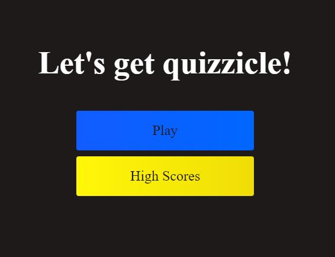
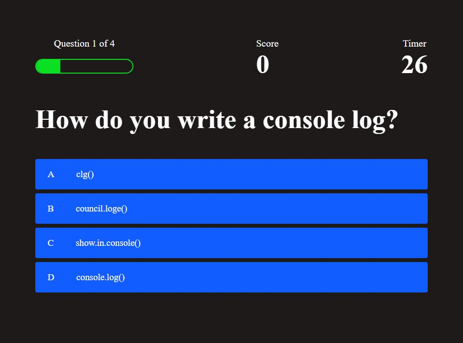
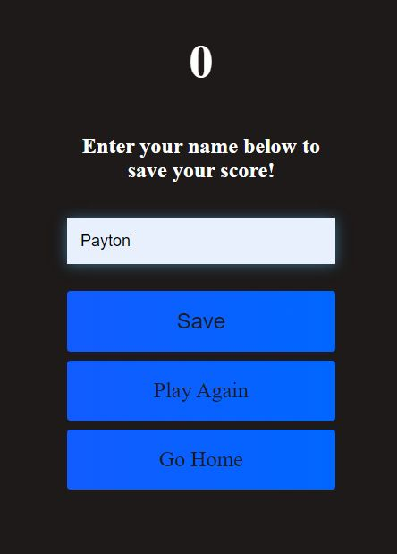

# quizyourself
### Description
Using javascript I created a quiz to test knowledge on some things we've learned pertaining to code. I used a score based system, but if the timer runs out then it'll end the quiz giving you the score based on how many correct answers you had.
### Links
[deployed-page](https://ikomeda.github.io/quizyourself/)
### Screenshot

